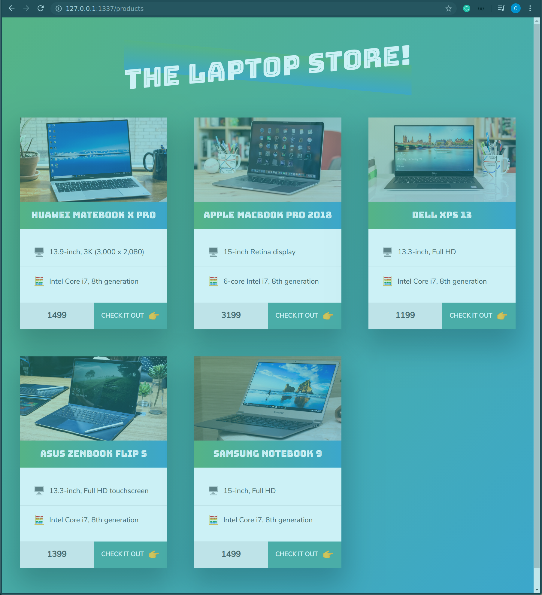
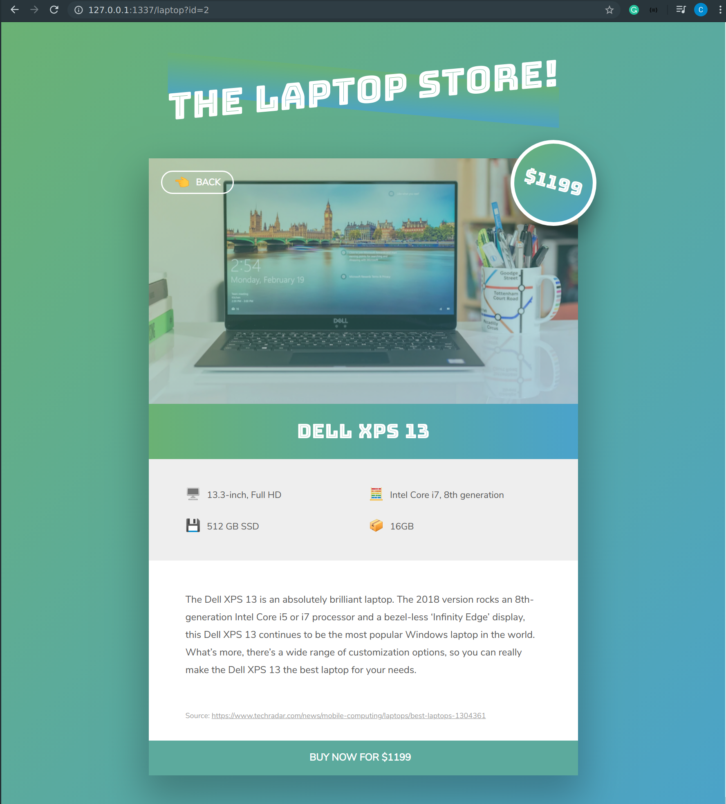

# LAPTOP STORE

An online laptop store homework project on Nodejs, Javascript, CSS, and HTML.

The goal of the exercise is to create a simple ecommerce store front page that requests products data from Node server, using pure JavaScript for backend development.

## Run App


## Technology Used

* HTML
* CSS
* JavaScript
* Nodejs

## Website Screenshot

### Store Font



### Products Page



## Code Snippets

### Js Code

```Js
const fs = require('fs');
const http = require('http');
const url = require('url');

const json = fs.readFileSync(`${__dirname}/data/data.json`, 'utf-8');
const laptopData = JSON.parse(json);
console.log(laptopData);

const server = http.createServer((req, res) => {

   const pathName = url.parse(req.url, true).pathname;
   const id = url.parse(req.url, true).query.id;
   // console.log(pathName);

   // PRODUCT OVERVIEW
   if (pathName === '/products' || pathName === '/') {
      res.writeHead(200, { 'Content-type': 'text/html' });

      fs.readFile(`${__dirname}/templates/overviewTemplate.html`, 'utf-8', (err, data) => {
         let oveviewOutput = data;

         fs.readFile(`${__dirname}/templates/productCardTemplate.html`, 'utf-8', (err, data) => {

            const cardsOutput = laptopData.map(el => replaceTemplate(data, el)).join('');
            oveviewOutput = oveviewOutput.replace('', cardsOutput);

            res.end(oveviewOutput);
         });

      });

   } else if (pathName === '/laptop' && id < laptopData.length) {
      res.writeHead(200, { 'Content-type': 'text/html' });

      fs.readFile(`${__dirname}/templates/laptopTemplate.html`, 'utf-8', (err, data) => {
         const laptop = laptopData[id];
         const output = replaceTemplate(data, laptop);
         res.end(output);
      });

   } else if ((/\.(jpg|jpeg|png|gif)$/i).test(pathName)) {
      fs.readFile(`${__dirname}/data/img/${pathName}`, (err, data) => {
         res.writeHead(200, { 'Content-type': 'image/jpg' });
         res.end(data);
      });
   } else {
      res.writeHead(404, { 'Content-type': 'text/html' });
      res.end('URL does not exist!');
   }
   console.log('Someone did access the server!');
});

server.listen(1337, '127.0.0.1', () => {
   console.log('Listening for requests now');
});

function replaceTemplate(originalHtml, laptop) {

   let output = originalHtml.replace(//g, laptop.productName);
   output = output.replace(//g, laptop.image);
   output = output.replace(//g, laptop.price);
   output = output.replace(//g, laptop.screen);
   output = output.replace(//g, laptop.cpu);
   output = output.replace(//g, laptop.storage);
   output = output.replace(//g, laptop.ram);
   output = output.replace(//g, laptop.description);
   output = output.replace(//g, laptop.id);
   return output;
}
```

### HTML Templates

```html
<body>
    <div class="container">
        <h1>The Laptop Store!</h1>
        <figure class="laptop">
            <p class="laptop__price">$</p>
            <a href="/products" class="laptop__back"><span class="emoji-left">👈</span>Back</a>
            <div class="laptop__hero">
                
            </div>
            <h2 class="laptop__name"></h2>
            <div class="laptop__details">
                <p><span class="emoji-left">🖥</span></p>
                <p><span class="emoji-left">🧮</span></p>
                <p><span class="emoji-left">💾</span></p>
                <p><span class="emoji-left">📦</span></p>
            </div>
            <p class="laptop__description"></p>
            <p class="laptop__source">Source: <a href="https://www.techradar.com/news/mobile-computing/laptops/best-laptops-1304361"
                    target="_blank">https://www.techradar.com/news/mobile-computing/laptops/best-laptops-1304361</a></p>
            <a href="#" class="laptop__link">Buy now for $ <span class="emoji-right"></span></a>
        </figure>
    </div>
</body>
```

### CSS Code

```css
<style>
   *,
   *::before,
   *::after {
      margin: 0;
      padding: 0;
      box-sizing: inherit;
   }

   html {
      font-size: 62.5%;
      box-sizing: border-box;
   }

   body {
      padding: 6rem 4rem 10rem;
      line-height: 1.7;
      font-family: "Nunito Sans", sans-serif;
      color: #555;
      min-height: 100vh;
      background: linear-gradient(to bottom right, #67b26f, #4ca2cd);
   }

   h1 {
      font-family: "Bungee Inline", sans-serif;
      font-weight: 400;
      font-size: 6rem;
      color: white;
      transform: skewY(-5deg);
      margin-bottom: 6rem;
      text-align: center;
      position: relative;
      word-spacing: 3px;
   }

   h1::before {
      content: '';
      display: block;
      height: 65%;
      width: 58%;
      position: absolute;
      top: 105%;
      left: 50%;
      background: linear-gradient(to bottom, #67b26f, #4ca2cd);
      opacity: .8;
      z-index: -1;
      transform: skewY(370deg) translate(-50%, -50%);
   }

   .container {
      width: 110rem;
      margin: 0 auto;
   }

   .laptop {
      width: 70rem;
      margin: 0 auto;
      background: white;
      box-shadow: 0 3rem 6rem 1rem rgba(0, 0, 0, 0.25);
      position: relative;
   }

   .laptop__hero {
      position: relative;
   }

   .laptop__hero::before {
      content: '';
      display: block;
      height: 100%;
      width: 100%;
      position: absolute;
      top: 0;
      left: 0;
      background-image: linear-gradient(to right bottom, #67b26f, #4ca2cd);
      opacity: .4;
   }

   .laptop__img {
      width: 100%;
      display: block;
   }

   .laptop__price {
      position: absolute;
      top: -3rem;
      right: -3rem;
      z-index: 100;
      background: linear-gradient(to right bottom, #67b26f, #4ca2cd);
      height: 14rem;
      width: 14rem;
      border: 6px solid white;
      border-radius: 50%;
      transform: rotate(15deg);
      box-shadow: 0 2rem 4rem rgba(0, 0, 0, 0.4);
      color: white;
      font-size: 3rem;
      font-family: "Bungee Inline", sans-serif;
      display: flex;
      align-items: center;
      justify-content: center;
   }

   .laptop__back:link,
   .laptop__back:visited {
      position: absolute;
      top: 2rem;
      left: 2rem;
      font-size: 1.5rem;
      color: white;
      font-weight: 700;
      text-transform: uppercase;
      text-decoration: none;
      z-index: 1;
      border: 2px solid white;
      border-radius: 100rem;
      padding: 0 2rem;
      transition: all .3s;
      display: flex;
      align-items: center;
   }

   .laptop__back:hover,
   .laptop__back:active {
      background-color: white;
      color: #555;
   }

   .laptop__name {
      background: linear-gradient(to right, #67b26f, #4ca2cd);
      padding: 1.75rem 1rem;
      font-family: "Bungee Inline", sans-serif;
      font-weight: 400;
      font-size: 3.25rem;
      color: white;
      text-align: center;
      word-spacing: 2px;
   }

   .laptop__details {
      background-color: #eee;
      padding: 4rem 6rem;
      font-size: 1.5rem;
      display: grid;
      grid-template-columns: 1fr 1fr;
      grid-gap: 1.75rem;
   }

   .laptop__description {
      padding: 5rem 6rem;
      font-size: 1.6rem;
      line-height: 1.8;
   }

   .laptop__link:link,
   .laptop__link:visited {
      display: block;
      background-color: #5aaa9d;
      color: white;
      font-size: 1.6rem;
      font-weight: 700;
      text-transform: uppercase;
      text-decoration: none;
      padding: 1.5rem;
      text-align: center;
      display: flex;
      align-items: center;
      justify-content: center;
      transition: all .3s;
   }

   .laptop__link:hover,
   .laptop__link:active {
      background-color: #67b26f;
   }

   .laptop__source {
      padding: 0 6rem 3rem;
      color: #999;
      font-size: 1.2rem;
   }

   .laptop__source a:link,
   .laptop__source a:visited {
      color: #999;
   }

   .laptop__source a:hover,
   .laptop__source a:active {
      color: #555;
   }

   .emoji-left {
      font-size: 2rem;
      margin-right: 1rem;
   }

   .emoji-right {
      font-size: 2rem;
      margin-left: 1rem;
   }
</style>
```
